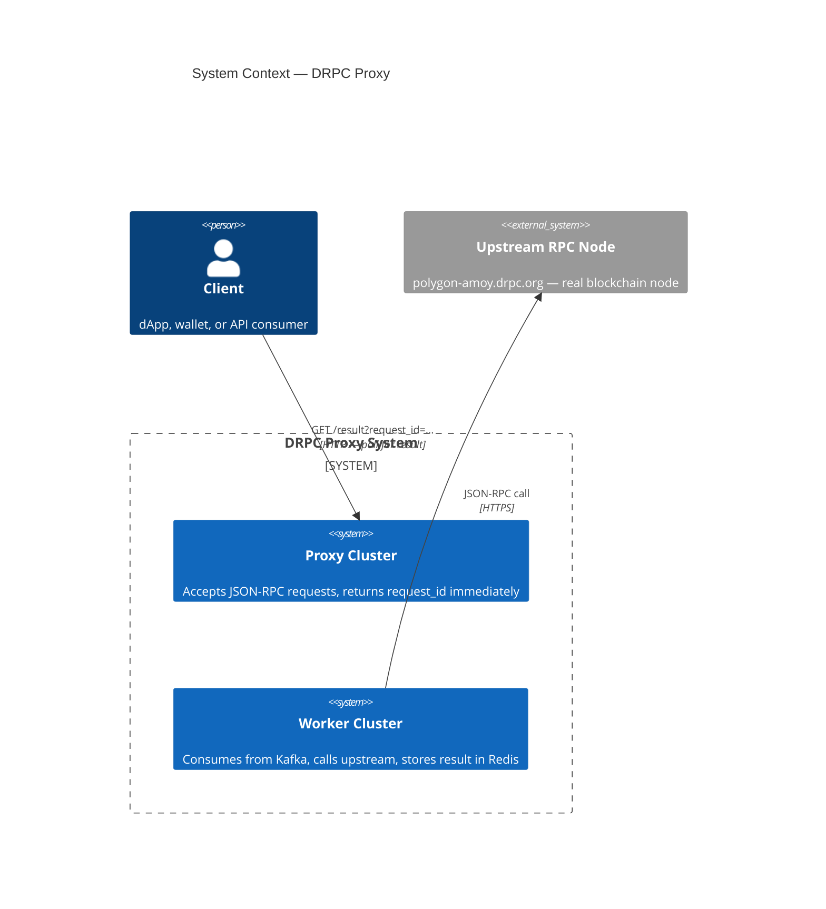
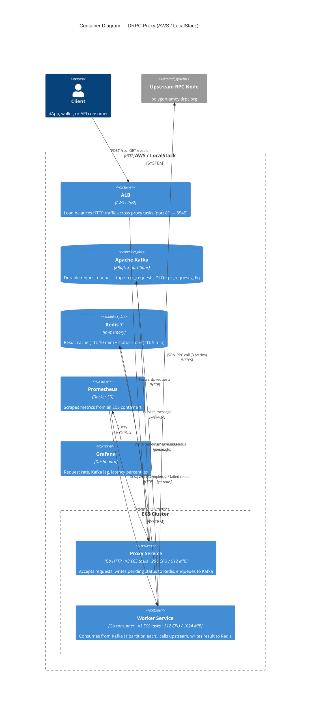
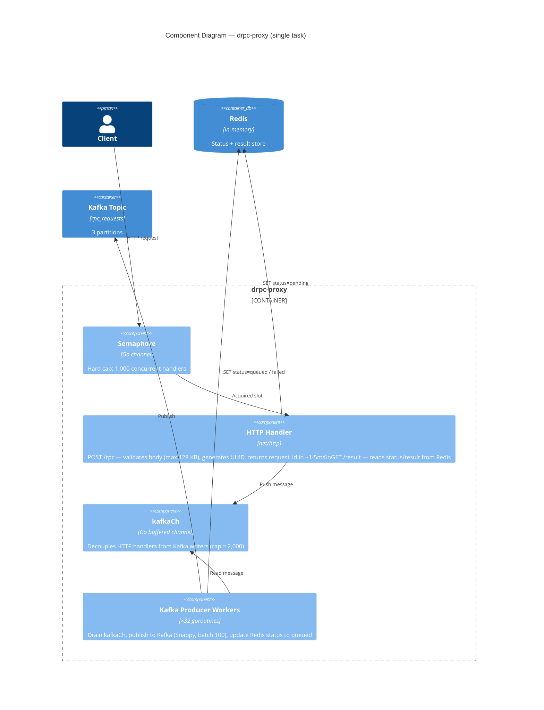
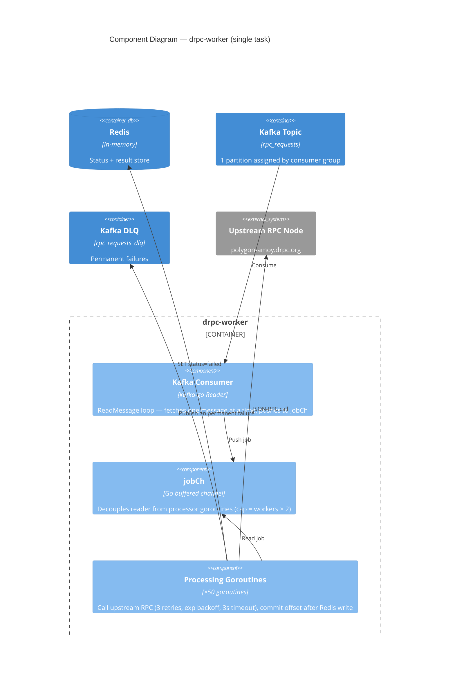
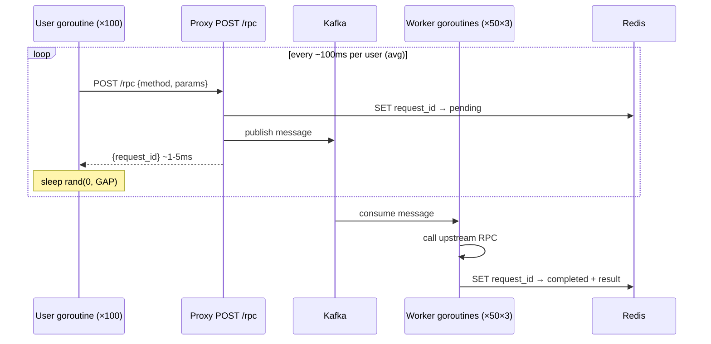

# DRPC Proxy

A high-throughput, async JSON-RPC proxy built in Go that decouples HTTP clients from upstream blockchain RPC nodes using Apache Kafka and Redis.

---

## Table of Contents

1. [Design](#1-design)
   - [Architecture Overview](#architecture-overview)
   - [C1 — System Context](#c1--system-context)
   - [C2 — Container Diagram](#c2--container-diagram)
   - [C3 — Component Diagram](#c3--component-diagram)
   - [Key Design Decisions](#key-design-decisions)
2. [Setup](#2-setup)
   - [Prerequisites](#prerequisites)
   - [Local Environment (LocalStack)](#local-environment-localstack)
   - [Running the Full Stack](#running-the-full-stack)
3. [Load Test](#3-load-test)
   - [Design](#load-test-design)
   - [Running](#running-the-load-test)
   - [QPS Capacity](#qps-capacity)

---

## 1. Design

### Architecture Overview

Traditional synchronous RPC proxies block an HTTP connection for the entire duration of the upstream call (100–500ms for blockchain nodes). Under load this exhausts connection pools and causes cascading timeouts.

DRPC Proxy solves this with a **fire-and-forget + poll** pattern:

1. The client **POSTs** a JSON-RPC request to the proxy and immediately receives a `request_id`.
2. The proxy enqueues the request into **Kafka** and saves a `pending` status in **Redis** — the HTTP response is returned in < 5ms.
3. A **Worker** pool consumes from Kafka, calls the upstream RPC node, and writes the result back to Redis.
4. The client **polls** `GET /result?request_id=<id>` until the status is `completed` or `failed`.

This completely decouples the ingest rate from the upstream processing rate, making the system resilient to upstream slowdowns without dropping requests.

---

### C1 — System Context



---

### C2 — Container Diagram



---

### C3 — Component Diagram





---

### Key Design Decisions

| Decision | Rationale |
|---|---|
| **Kafka as request queue** | Durable, replayable, absorbs bursts; back-pressure is natural (Kafka lag) |
| **Redis for result storage** | Sub-millisecond reads; TTL-based cleanup (5–10 min) avoids manual GC |
| **Fire-and-forget + poll** | HTTP connection holds for < 5ms regardless of upstream latency |
| **Semaphore on proxy** | Hard cap on concurrent HTTP handlers prevents runaway goroutine growth |
| **Manual Kafka commit** | Offset only advances after Redis write succeeds — no silent result loss |
| **DLQ on permanent failure** | Failed messages are preserved for inspection/replay rather than dropped |
| **3 partitions ↔ 3 workers** | Each worker owns one partition; goroutines provide intra-partition parallelism |

---

## 2. Setup

### Prerequisites

| Tool | Purpose | Install |
|---|---|---|
| **Go 1.22+** | Build binaries | https://go.dev/dl |
| **Docker + Docker Compose** | Run all infrastructure locally | https://docs.docker.com/get-docker |
| **Task** | Task runner (`Taskfile.yml`) | `brew install go-task` / https://taskfile.dev |
| **Terraform 1.5+** | Provision ECS / ALB / ECR on LocalStack | https://developer.hashicorp.com/terraform/install |
| **AWS CLI v2** | Interact with LocalStack | https://docs.aws.amazon.com/cli/latest/userguide/install-cliv2.html |
| **LocalStack Pro** | AWS Fargate (ECS) emulator | Requires `LOCALSTACK_AUTH_TOKEN` env var |

> **Why LocalStack?**  
> We use [LocalStack Pro](https://localstack.cloud) to simulate the full AWS deployment — ECS Fargate tasks, ECR image registry, ALB load balancer, CloudWatch Logs, Secrets Manager, and IAM — entirely on your laptop. The application code and Terraform configuration are identical between local and production; only the provider endpoint changes (`http://localstack:4566`).

---

### Local Environment (LocalStack)

**Export your LocalStack auth token** (required for ECS support):

```bash
export LOCALSTACK_AUTH_TOKEN=<your-token>
```

---

### Running the Full Stack

#### Step 1 — Start infrastructure

```bash
task docker:up
```

Starts Kafka (KRaft mode), Redis, and LocalStack in Docker Compose, then joins the devcontainer to the shared Docker network.

#### Step 2 — Initialise Terraform

```bash
task local:init
```

Downloads the AWS provider (runs once).

#### Step 3 — Build and push images to LocalStack ECR

```bash
task local:push
```

Builds `drpc-proxy` and `drpc-worker` Docker images and pushes them to the LocalStack ECR registry.

#### Step 4 — Deploy ECS services (mock mode)

```bash
task local:apply:mock
```

Provisions ECS cluster, task definitions, services (3 proxy + 3 worker tasks), ALB, and security groups via Terraform. Workers run in **mock mode** — no real upstream calls, simulated 100–200ms latency.

For real upstream calls (requires a valid `UPSTREAM_URL`):

```bash
task local:apply
```

#### Step 5 — Start monitoring

```bash
task monitoring:up
```

Starts Prometheus (port `9090`) and Grafana (port `3000`). Prometheus uses Docker Service Discovery to automatically scrape all ECS containers. Grafana is pre-provisioned with a dashboard showing request rate, Kafka throughput, worker processing rate, and latency percentiles.

#### Step 6 — Verify

```bash
task test:manual
```

Sends a single `eth_blockNumber` RPC request through the proxy and polls until the result is available.

#### Tear down

```bash
task local:destroy
task docker:down
```

---

### Directory Structure

```
.
├── cmd/
│   ├── proxy/          # Proxy HTTP server entrypoint
│   └── worker/         # Kafka consumer worker entrypoint
├── internal/
│   ├── proxy/          # HTTP handler, Kafka producer workers, semaphore
│   ├── worker/         # Message processor (real + mock)
│   ├── kafka/          # Consumer (job dispatch, DLQ, commit)
│   ├── redis/          # Result store
│   └── const.go        # All tuneable constants
├── terraform/
│   ├── modules/
│   │   ├── ecs/        # ECS cluster, task definitions, services
│   │   └── networking/ # VPC, subnets, ALB
│   ├── localstack.tfvars
│   └── main.tf
├── tests/
│   ├── e2e/            # End-to-end tests
│   └── load/           # Continuous load test (see §3)
├── deploy/
│   └── grafana/        # Prometheus config, Grafana dashboard JSON
├── docker-compose.yml
└── Taskfile.yml
```

---

## 3. Load Test

### Load Test Design

The load test (`tests/load/load_test.go`, build tag `load`) simulates **real user behaviour** rather than a bulk-sender:

- **N independent user goroutines** each loop continuously: send a request → sleep a random duration in `[0, GAP)` → repeat.
- This produces a **Poisson-like arrival process** (random inter-arrival times) rather than a synchronized burst, which is far more representative of real traffic.
- Requests rotate through 5 Ethereum JSON-RPC methods: `eth_blockNumber`, `eth_gasPrice`, `eth_chainId`, `eth_getBlockByNumber`, `net_version`.
- The test is **fire-and-forget** — it measures the proxy ingest path only (POST `/rpc` round-trip latency), not end-to-end result latency. This reflects the actual client experience: the proxy accepts immediately and the client polls separately.
- Every **10 seconds** a stats window is printed: total sent, ok/err counts, instant req/s, cumulative avg req/s, and a latency histogram (p50/p90/p95/p99/max).


- Runs until **Ctrl+C** or `DURATION` flag expires.

```
Each user goroutine:

  ┌─────────────────────────────────────────────────┐
  │  loop:                                          │
  │    POST /rpc  ──────────────────────────────►   │
  │               ◄──────────────────────────────   │
  │               {request_id, status:"accepted"}   │
  │    sleep rand(0, GAP)                           │
  └─────────────────────────────────────────────────┘
```

### Running the Load Test

```bash
# Default: 100 users, 0–200ms gap per user (~1,000 req/s), runs until Ctrl+C
task test:load

# Custom parameters
task test:load USERS=50 GAP=400ms           # ~250 req/s (light)
task test:load USERS=100 GAP=100ms          # ~2,000 req/s (stress)
task test:load USERS=100 GAP=200ms DURATION=5m  # fixed duration

# Override target (bypass ALB, hit single proxy directly)
PROXY_ADDR=http://172.19.0.5:8545 task test:load
```

The task auto-detects the ALB (`drpc-local-alb.elb.localhost.localstack.cloud`) if available, otherwise falls back to a single proxy container IP.

### QPS Capacity

Capacity is governed by the worker processing pipeline:

$$\text{max msg/s} = \frac{\text{worker tasks} \times \text{goroutines per task}}{\text{avg upstream latency}}$$

| Scenario | Workers | Goroutines | Avg Latency | Capacity |
|---|---|---|---|---|
| **Local mock (default)** | 3 | 50 | 150ms | **~1,000 msg/s** |
| Local mock (fast) | 3 | 50 | 30ms | ~5,000 msg/s |
| Production (real upstream) | 3 | 50 | 300ms | ~500 msg/s |
| Scale-out | 6 | 50 | 150ms | ~2,000 msg/s |

> **Kafka partitions = ceiling on worker tasks.** The topic has 3 partitions; adding a 4th worker container gains nothing. To scale beyond ~1,000 msg/s with 150ms latency, increase partitions and `worker_desired_count` together.

**Default load test vs capacity:**

| Parameter | Value |
|---|---|
| Users | 100 |
| Gap | 0–200ms (avg 100ms) |
| Ingest rate | ~1,000 req/s |
| Worker capacity (150ms latency) | ~1,000 msg/s |
| Kafka lag (steady state) | ≈ 0 |

**Proxy ingest path latency** (POST `/rpc`, no upstream involved):

| Percentile | Observed |
|---|---|
| p50 | < 5ms |
| p95 | < 15ms |
| p99 | < 30ms |

The proxy itself is not the bottleneck. The semaphore (1,000 slots) and the `kafkaCh` buffer (2,000 slots per instance × 3 instances = 6,000 total) provide headroom for burst traffic well beyond the worker consumption rate, with Kafka acting as the durable overflow buffer.
